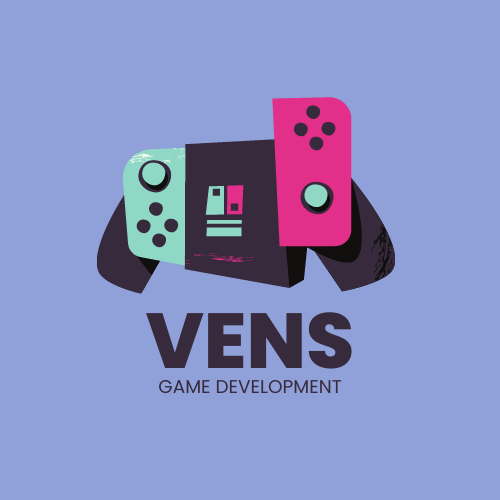
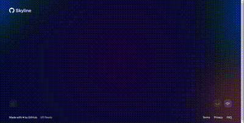

###

<h1>👋 Welcome to my Profile!</h3>

# Hi, I'm Muhammad Iven Fesky

I love when I can realize my ideas. It's satisfying to see it work & help others. Nothing more to tell here ¯\_(ツ)_/¯

My Many Obsessions: 
- Blender 
- Unreal Engine 
- Unity 
- AI [Text/Image] 
- HTML, CSS and Java Script 
- Game Developement 
- Games 
- Web Developement

  
  
  
  
  
  
  

  <a href="">Web</a> •
  <a href="https://discordapp.com/users/536022513885642762">Discord</a> •
  <a href="https://www.facebook.com/muhammad.feskyrhc/">Facebook</a> •
  <a href="https://www.instagram.com/ivenfesky/">Instagram</a> •
  <a href="https://www.linkedin.com/in/iven-fesky-018426218/">LinkedIn</a> •
  <a href="">Showwcase</a> •
  <a href="https://www.youtube.com/channel/UCRcovbduuOHShY-fLF0O5lw">Youtube</a>

<!-- Counting views, -->
<!--
Since 16 February 2023
-->

<b>I live in Indonesia</b>

**🔭 Current Project:** Start-up

**🌱 Currently Learning:** Google Bangkit 2023

**🤔 Thinking about:** Looking for collaboration

**📫 Email me:** ivenfesky80@gmail.com

**😄 Pronouns:** he/him/his

#### :medal_military: My Badge

  

## 👩🏻‍💻 Tech Stack 

 

 </img>

## Contribution Skyline - 2022

  

